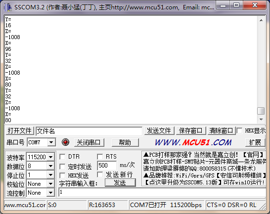
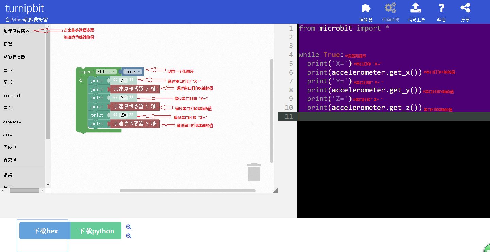

TurnipBit开发板加速度串口打印
==================================

一、什么是TurnipBit开发板
------------------------------------

   TurnipBit开发板由TurnipSmart公司制作的一款MicroPython开发板，基于nrf51822芯片为主控芯片，以MKL26Z128VFM4芯片作为边载辅助芯片，板载5*5LED灯，板载加速度传感器，板载磁敏传感器灯多种外设器件，同时支持图形编程及MicroPython代码编程控制的高智能芯片开发板。
   
   确保广大爱好者零基础学习单片机。

二、利用TurnipBit开发板完成加速度值的获取与打印
-----------------------------------------------------

1、具体要求
-------------------

    利用TurnipBit开发板完成加速度值的串口输出，通过借助串口助手，接收由开发板返回的当前开发板的加速度的值。

2、所需器件
--------------------------

   TurnipBit开发板开发板  一块

   加速度传感器为板载器件

3、串口介绍
------------------

   串行接口 (Serial Interface) 是指数据一位一位地顺序传送，其特点是通信线路简单，只要一对传输线就可以实现双向通信（可以直接利用电话线作为传输线），从而大大降低了成本，特别适用于远距离通信，但传送速度较慢。一条信息的各位数据被逐位按顺序传送的通讯方式称为串行通讯。串行通讯的特点是：数据位的传送，按位顺序进行，最少只需一根传输线即可完成；成本低但传送速度慢。串行通讯的距离可以从几米到几千米；根据信息的传送方向，串行通讯可以进一步分为单工、半双工和全双工三种。

4、加速度传感器介绍
-------------------------

   加速度传感器，包括由硅膜片、上盖、下盖，膜片处于上盖、下盖之间，键合在一起；一维或二维纳米材料、金电极和引线分布在膜片上，并采用压焊工艺引出导线；工业现场测振传感器，主要是压电式加速度传感器。其工作原理主要利于压电敏感元件的压电效应得到与振动或者压力成正比的电荷量或者电压量。目前工业现场典型采用IEPE型加速度传感器，及内置IC电路压电加速度传感器，传感器输出与振动量正正比的电压信号，例如：100mV/g (每个加速度单位输出100mV电压值。1g=9.81m/s-2)。

三、制作主要过程
----------------------------

先上个图，下面再开始说代码的问题。

1、制作流程
-----------------

1.首先需要声明类库；

2.定义需要用到的变量；

3.开始主函数的编写，首先打印字符“X=”；

4.读出当前的加速度传感X轴的值，并通过串口打印；

5.打印字符“Y=”；

6.读出当前的加速度传感Y轴的值，并通过串口打印；

7.打印字符“Z=”；

8.读出当前的加速度传感Z轴的值，并通过串口打印；

9.完成以上代码编写后，就完成了整个程序的逻辑编写，开始无限循环。

2、具体代码
--------------------

注：这个代码上面是一直在循环打印当前的加速度的值，要是嫌打印的太快，可以在循环中加上一个延时。
