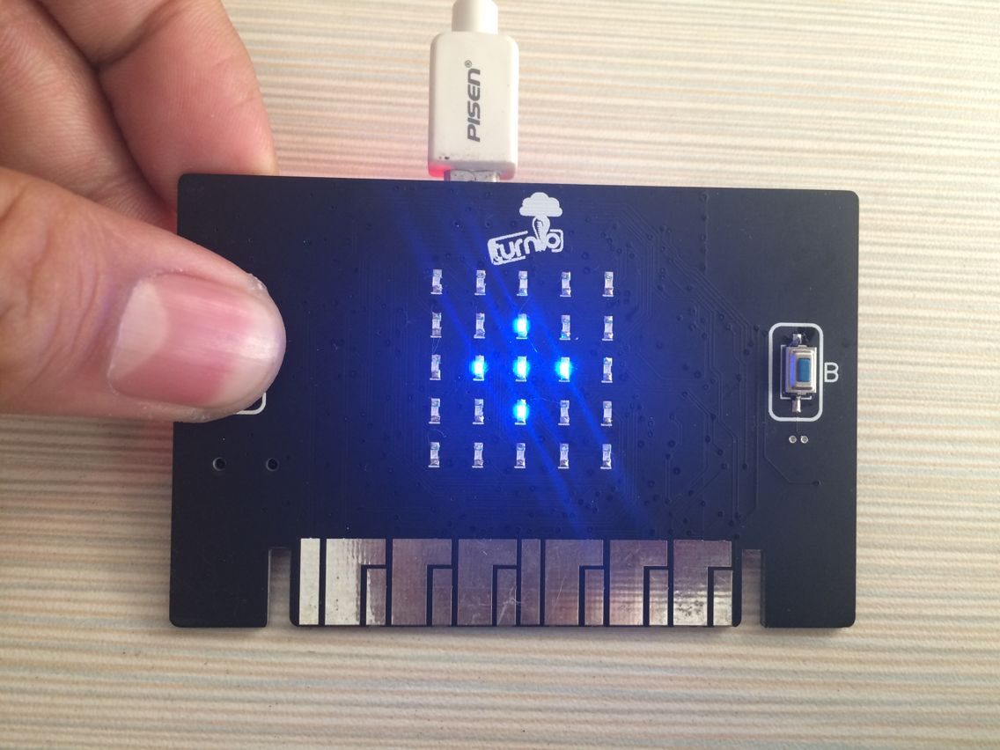
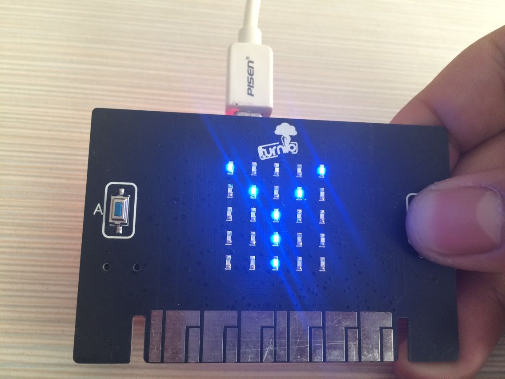

TurnipBit开发板按键控制显示图形
====================================

一、什么是TurnipBit开发板
-------------------------------

	TurnipBit开发板由TurnipSmart公司制作的一款MicroPython开发板，基于nrf51822芯片为主控芯片，以MKL26Z128VFM4芯片作为边载辅助芯片，板载5*5LED灯，板载加速度传感器，板载磁敏传感器灯多种外设器件，同时支持图形编程及MicroPython代码编程控制的高智能芯片开发板。

	确保广大爱好者零基础学习单片机。

二、利用TurnipBit开发板完成按键控制显示图形
------------------------------------------------

1、具体要求
-------------------------

	利用TurnipBit开发板完成按键控制板载LED灯显示不同的图形。按键A按下时，显示“Y”，按键B按下时，显示“+”。按键A ,B都没有按下的时候，显示“*”.

2、所需器件
----------------------------------------

	TurnipBit开发板开发板  一块
	
	按键为板载器件

3、串口介绍
-------------------

	按键开关主要是指轻触式按键开关，也称之为轻触开关。按键开关是一种电子开关，属于电子元器件类，最早出现在日本称之为：敏感型开关，使用时以满足操作力的条件向开关操作方向施压开关功能闭合接通，当撤销压力时开关即断开，其内部结构是靠金属弹片受力变化来实现通断的。
	按键开关有接触电阻荷小、精确的操作力误差、规格多样化等方面的优势，在电子设备及白色家电等方面得到广泛的应用如：影音产品、数码产品、遥控器、通讯产品、家用电器、安防产品、玩具、电脑产品、健身器材、医疗器材、验钞笔、雷射笔按键等等。因为按键开关对环境的条件（施压力小于2倍的弹力/环境温湿度条件以及电气性能）大型设备及高负荷的按钮都使用导电橡胶或锅仔开关五金弹片直接来代替，比如医疗器材、电视机遥控器等。

三、制作主要过程
------------------------------

先上个图，下面再开始说代码的问题。

.. image:: images/T1.jpg

1、制作流程

----------------------------

1.首先需要声明类库；

2.定义需要用到的变量（这里没有用到变量，不用定义）；

3.开始主函数的编写，第一步判断按键A是否按下；

4.如果按键A按下，则显示“+”；

5.判断按键B是否按下；

6.如果按键B按下，则显示“Y”；

7.如果按键A,B都没有按下，则显示“*”；

8.完成以上代码编写后，就完成了整个程序的逻辑编写，开始无限循环，不断的扫描按键状态。

2、具体代码
--------------------

Python代码::

from microbit import *#声明变量

while True:

	if button_a.is_pressed():#判断按键A是否按下
	
		display.show("+")#显示图形“+”
		
	elif button_b.is_pressed():#判断按键B是否按下
	
		display.show("Y")#显示图形“Y”
		
	else:
	
		display.show("*")#显示图形“*”
