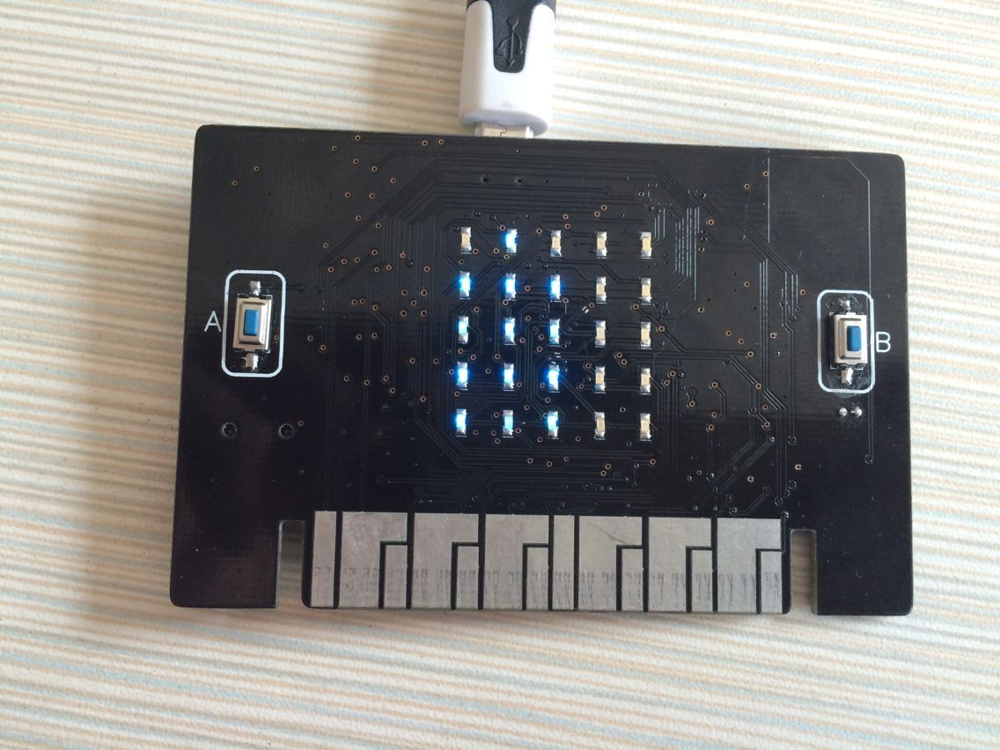
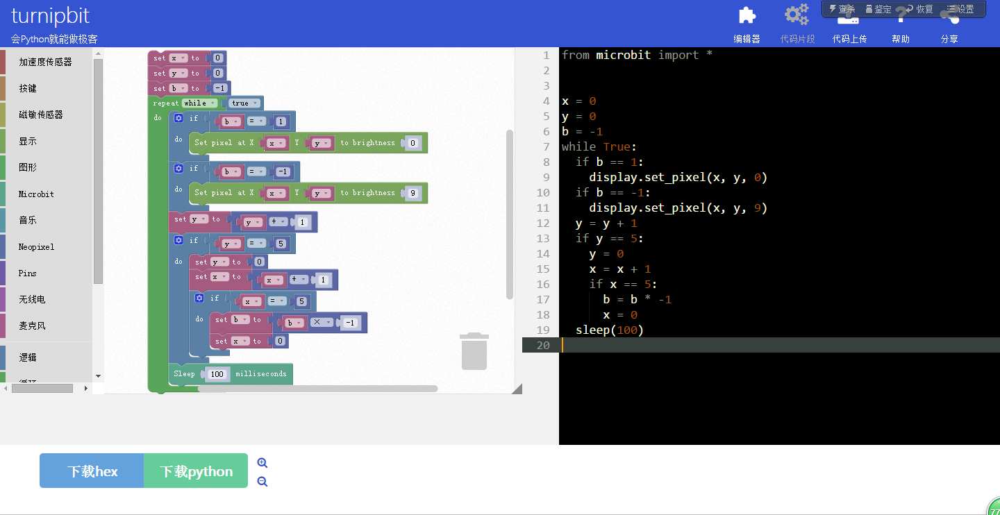
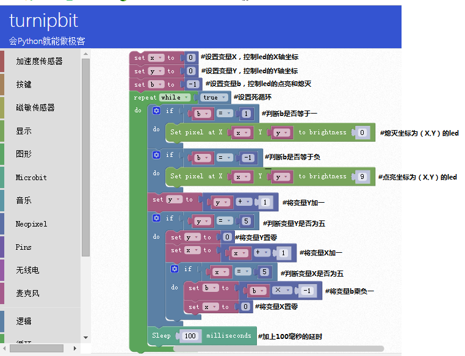

TurnipBit开发板板载流水灯
==================================

一、什么是TurnipBit开发板
-------------------------------------

	TurnipBit开发板由TurnipSmart公司制作的一款MicroPython开发板，基于nrf51822芯片为主控芯片，以MKL26Z128VFM4芯片作为边载辅助芯片，板载5*5LED灯，板载加速度传感器，板载磁敏传感器灯多种外设器件，同时支持图形编程及MicroPython代码编程控制的高智能芯片开发板。
	
	确保广大爱好者零基础学习单片机。

二、利用TurnipBit开发板完成板载流水灯
--------------------------------------

1、具体要求
--------------------

	利用TurnipBit开发板完成按键控制板载LED灯进行流水显示，首先逐个led点亮，等到所有的led点亮后，逐个led熄灭。

2、所需器件
---------------------------

	TurnipBit开发板开发板  一块

	led为板载器件

3、LED介绍
--------------------

	发光二极管简称为LED。由含镓(Ga)、砷(As)、磷(P)、氮(N)等的化合物制成。当电子与空穴复合时能辐射出可见光，因而可以用来制成发光二极管。在电路及仪器中作为指示灯，或者组成文字或数字显示。砷化镓二极管发红光，磷化镓二极管发绿光，碳化硅二极管发黄光，氮化镓二极管发蓝光。因化学性质又分有机发光二极管OLED和无机发光二极管LED。

4、流水灯简介
----------------------

	就是一组灯，然后在控制系统的控制下按照设定的顺序和时间来发亮和熄灭，这样就能形成一定的视觉效果，很多街上的店面和招牌上面就安了流水灯，看上去更美观。

三、制作主要过程
----------------------------

先上个图，下面再开始说代码的问题。

实物图片

代码截图
再放上一个视频链接：
https://v.qq.com/x/page/e0509rnqn5r.html

1、制作流程
----------------------

1.首先需要定义要用到的变量，这次用到了三个变量：“X”控制led的X轴坐标，“Y”控制led的Y轴坐标，“b”控制是点亮led还是熄灭led；

2.设置一个死循环；

3.判断b是否等于1；

4.如果b等于1，熄灭坐标为（X,Y）的led；

5.判断b是否等于-1；

6.如果b等于-1，点亮坐标为（X,Y）的led；

7.变量Y加一；

8.判断变量Y是否等于5；

9.如果变量Y等于5，将变量Y置零，将变量X加一，判断变量X是否等于5；

10.如果变量X等于5，将变量b乘负一，将变量X置零；

11.延时100毫秒，并执行无限循环。

2、具体代码：
---------------------

图形代码：

Python代码::

from microbit import *#声明类库

x = 0#定义变量X，控制led的X轴

y = 0#控制变量Y，控制led的Y轴

b = -1#控制变量b，控制点亮和熄灭

while True:#设置死循环

  if b == 1:#判断b是否等于1
  
    display.set_pixel(x, y, 0)#将坐标为(X,Y)的led熄灭
	
  if b == -1:#判断b是否等于-1
  
    display.set_pixel(x, y, 9)#将坐标为(X,Y)的led点亮
	
  y = y + 1#将变量Y加1
  
  if y == 5:#判断变量Y是否等于5
  
    y = 0#将变量Y置零
	
    x = x + 1#将变量X加1
    if x == 5:#判断变量X是否等于5
	
      b = b * -1#将变量b乘-1
	  
      x = 0#将变量X置零
	  
  sleep(100)#延时100毫秒
