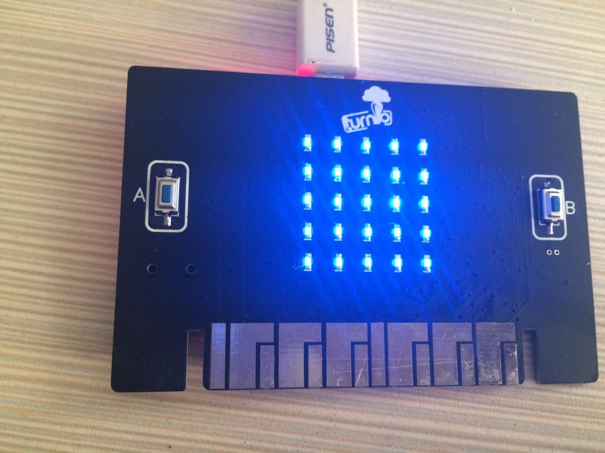
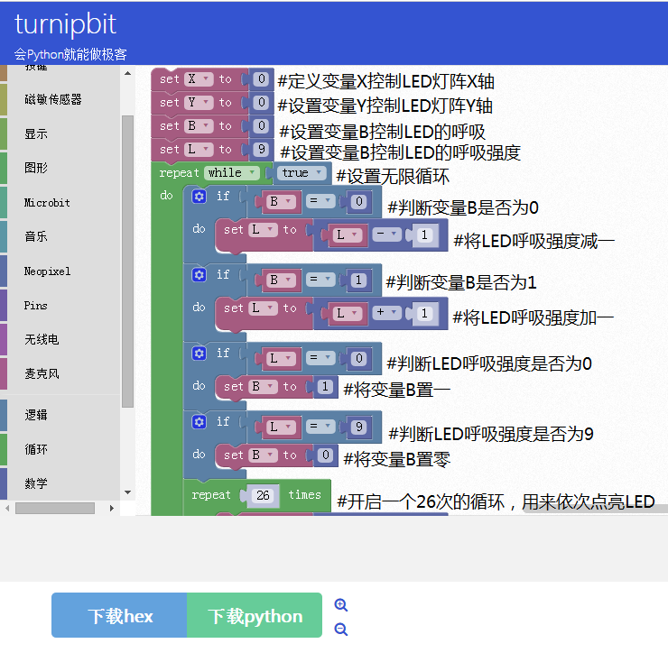
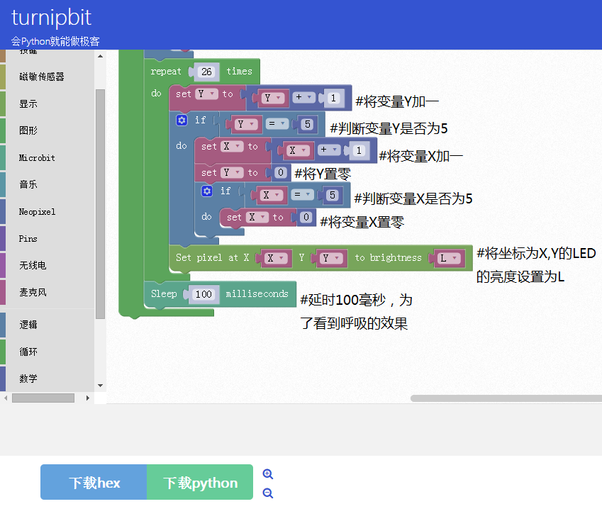

TurnipBit完成呼吸灯
=============================

一、什么是TurnipBit开发板
------------------------------------

TurnipBit开发板由TurnipSmart公司制作的一款MicroPython开发板，基于nrf51822芯片为主控芯片，以MKL26Z128VFM4芯片作为边载辅助芯片，板载5*5LED灯，板载加速度传感器，板载磁敏传感器灯多种外设器件，同时支持图形编程及MicroPython代码编程控制的高智能芯片开发板。
确保广大爱好者零基础学习单片机。

二、利用TurnipBit完成呼吸灯阵的制作
-------------------------------------------------

1、具体要求
----------------------

利用TurnipBit开发板完成板载的5*5 LED灯阵呼吸显示，做一个呼吸灯阵。

2、所需器件
------------------------------------
TurnipBit开发板开发板  一块

板载LED					一根

3、PWM介绍
-----------------------------
脉冲宽度调制(PWM)，是英文“Pulse Width Modulation”的缩写，简称脉宽调制，是利用微处理器的数字输出来对模拟电路进行控制的一种非常有效的技术，广泛应用在从测量、通信到功率控制与变换的许多领域中。
航模中的控制信号大多是PWM信号，比如FUTABA,JR等舵机的控制都采用PWM方式。
发射机给接收机一串脉冲，比如基础脉宽是100ms，那么发射机的脉宽变大时，比如增大为150ms，那么接收机就控制舵机正向旋转，发射的脉宽减小时，比如减小为50ms，那么接收机就控制舵机逆向旋转。

三、制作主要过程
----------------------

先上个图，下面再开始说代码的问题。

附上一个视频效果链接：
https://v.qq.com/x/page/h0513jdzcsz.html

1、制作流程
------------------

图形代码：

