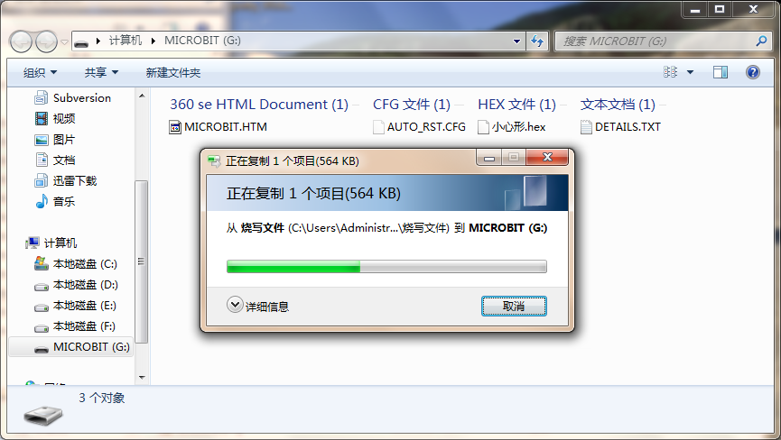

turnipbbit 的耳机使用
==================================

1.什么是TurnipBit开发板
---------------------------------------

TurnipBit开发板由TurnipSmart公司制作的一款MicroPython开发板，基于nrf51822芯片为主控芯片，以MKL26Z128VFM4芯片作为边载辅助芯片，板载5*5LED灯，板载加速度传感器，板载磁敏传感器灯多种外设器件，同时支持图形编程及MicroPython代码编程控制的高智能芯片开发板。

确保广大爱好者零基础学习单片机。

2.利用turnipbbit 的耳机听音乐
-------------------------------------------------

2.1具体要求
----------------------------------------------
利用TurnipBit开发板板载的耳机接口听音乐。

2.2所需器件
----------------------------------------------
TurnipBit开发板开发板		一块
耳机					 	一个
耳机接口为板载器件

1、耳机介绍
------------------

耳机是一对转换单元，它接受媒体播放器或接收器所发出的电讯号，利用贴近耳朵的扬声器将其转化成可以听到的音波。耳机一般是与媒体播放器可分离的，利用一个插头连接。好处是在不影响旁人的情况下，可独自聆听音响；亦可隔开周围环境的声响，对在录音室、DJ、旅途、运动等在噪吵环境下使用的人很有帮助。耳机原是给电话和无线电上使用的，但随着可携式电子装置的盛行，耳机多用于手机、随身听、收音机。可携式电玩和数位音讯播放器等。

3.制作主要过程
----------------------------

3.1制作流程
---------------------

1.在打开网址http://turnipbit.tpyboard.com/之后，点击界面右上角的“编辑器”，进入图形编辑界面，如下图

.. image:: images/TBJJ1.png

;
2.在界面左面的命令选择区域选择需要的命令；

.. image:: images/TBJJ2.png

；
3.在命令选择区域选择音乐，如图：

4.在音乐命令里面选择“play”这个选项，如图：

5.把这个音乐的命令加入到图形编程框中，如图：

6.绘制完成你想要的图案后，点击左下角的下载hex，即可得到想要的固件；
7.在Turnipbit插上电脑后，出现一个盘符，打开盘符，把刚刚下载的固件复制进去，在复制固件进去的时候，板载的黄色指示灯会闪烁，同时在电脑界面会出现如下界面：

8.固件复制完成后，Turnipbit会自动执行新的程序。
