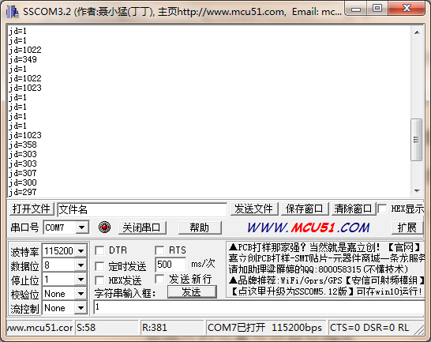
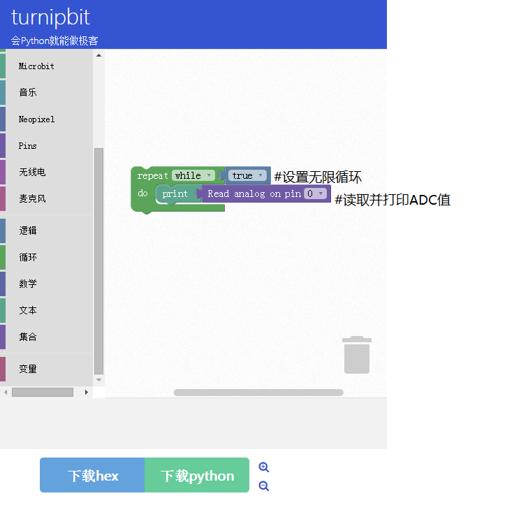

TurnipBit开发板串口输出ADC值
==================================

一、什么是TurnipBit开发板
--------------------------------

	TurnipBit开发板由TurnipSmart公司制作的一款MicroPython开发板，基于nrf51822芯片为主控芯片，以MKL26Z128VFM4芯片作为边载辅助芯片，板载5*5LED灯，板载加速度传感器，板载磁敏传感器灯多种外设器件，同时支持图形编程及MicroPython代码编程控制的高智能芯片开发板。
	
	确保广大爱好者零基础学习单片机。

二、利用TurnipBit开发板完成串口输出ADC的值
------------------------------------------------------------

1、具体要求
----------------------

	利用TurnipBit开发板完成GPIO口模拟值采集，并通过串口输出，通过借助串口助手显示当前返回开发板的P0接口的模拟值。

2、所需器件
------------------------

TurnipBit开发板开发板	一块

杜邦线					一根

3、串口介绍
----------------------

	串行接口 (Serial Interface) 是指数据一位一位地顺序传送，其特点是通信线路简单，只要一对传输线就可以实现双向通信（可以直接利用电话线作为传输线），从而大大降低了成本，特别适用于远距离通信，但传送速度较慢。一条信息的各位数据被逐位按顺序传送的通讯方式称为串行通讯。串行通讯的特点是：数据位的传送，按位顺序进行，最少只需一根传输线即可完成；成本低但传送速度慢。串行通讯的距离可以从几米到几千米；根据信息的传送方向，串行通讯可以进一步分为单工、半双工和全双工三种。

4、ADC介绍
------------------

	模数转换器即A/D转换器，或简称ADC，通常是指一个将模拟信号转变为数字信号的电子元件。通常的模数转换器是将一个输入电压信号转换为一个输出的数字信号。由于数字信号本身不具有实际意义，仅仅表示一个相对大小。故任何一个模数转换器都需要一个参考模拟量作为转换的标准，比较常见的参考标准为最大的可转换信号大小。而输出的数字量则表示输入信号相对于参考信号的大小。

三、制作主要过程
-------------------------

先上个图，下面再开始说代码的问题。

1、制作流程
----------------------

