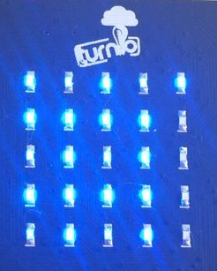
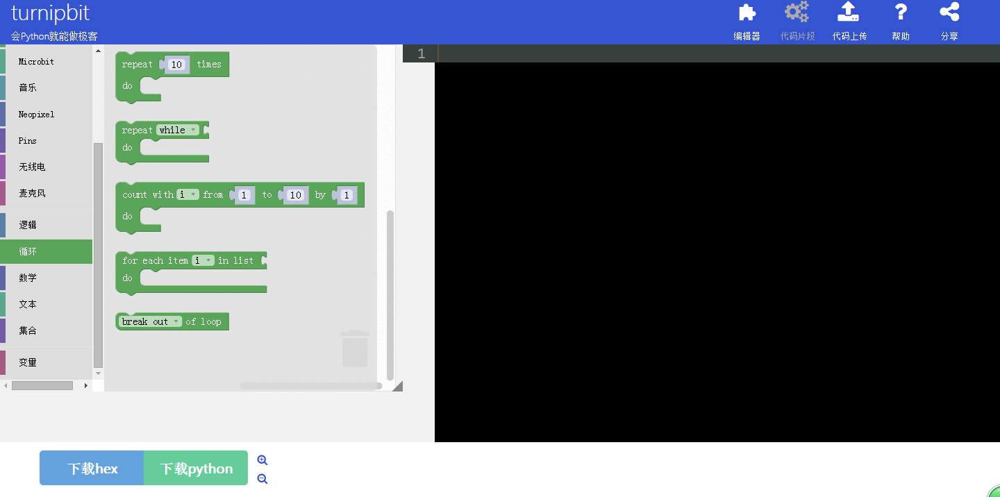
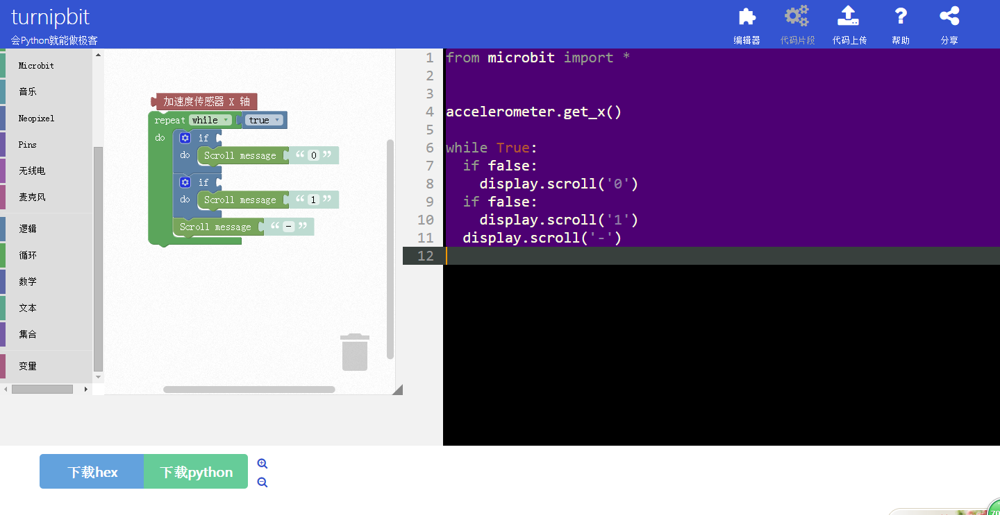

turnipbit的加速度传感器使用
================================

1.什么是TurnipBit开发板
--------------------------------------

TurnipBit开发板由TurnipSmart公司制作的一款MicroPython开发板，基于nrf51822芯片为主控芯片，以MKL26Z128VFM4芯片作为边载辅助芯片，板载5*5LED灯，板载加速度传感器，板载磁敏传感器灯多种外设器件，同时支持图形编程及MicroPython代码编程控制的高智能芯片开发板。

确保广大爱好者零基础学习单片机。

2.利用TurnipBit开发板完成倾斜状态LED显示
---------------------------------------------------

2.1具体要求
--------------------

利用TurnipBit开发板完成加速度传感器判断开发板的倾斜状态，判断加速度的Y轴倾斜值，向左偏移板载LED显示“1”，向右偏移显 示“0”，处于平衡位置，显示“-”。

2.2所需器件
----------------------

TurnipBit开发板开发板  一块

5*5LED点阵为板载器件

加速度传感器为板载器件

1、LED介绍
--------------------------------

发光二极管简称为LED。由含镓(Ga)、砷(As)、磷(P)、氮(N)等的化合物制成。当电子与空穴复合时能辐射出可见光，因而可以用来制成发光二极管。在电路及仪器中作为指示灯，或者组成文字或数字显示。砷化镓二极管发红光，磷化镓二极管发绿光，碳化硅二极管发黄光，氮化镓二极管发蓝光。因化学性质又分有机发光二极管OLED和无机发光二极管LED。

2、加速度传感器简介
----------------------------------

加速度传感器，包括由硅膜片、上盖、下盖，膜片处于上盖、下盖之间，键合在一起；一维或二维纳米材料、金电极和引线分布在膜片上，并采用压焊工艺引出导线；工业现场测振传感器，主要是压电式加速度传感器。其工作原理主要利于压电敏感元件的压电效应得到与振动或者压力成正比的电荷量或者电压量。目前工业现场典型采用IEPE型加速度传感器，及内置IC电路压电加速度传感器，传感器输出与振动量正正比的电压信号，例如：100mV/g?(每个加速度单位输出100mV电压值。1g=9.81m/s-2)。

三、制作主要过程
---------------------------------

先上个图，下面再开始说代码的问题。

.. image:: images/13.jpg

1、制作流程
-----------------------------------------------------
1.在打开网址http://turnipbit.tpyboard.com/之后，点击界面右上角的“编辑器”，进入图形编辑界面，如下图

.. image:: images/TBJJ1.png

;
2.在界面左面的命令选择区域选择需要的命令；

3.因为想要LED点阵显示字符串，所以要选择一个字符串显示的命令，可以看到，在左面的图形编程框中放入新的命令后，在右面的MicroPython代码显示框中，会出现相应的代码语句，如下图：
3.1点击左侧命令选择区域的“显示”；

.. image:: images/TBJJ4.png

3.2在显示中选择箭头所指的字符串输出命令；

3.3选中字符串输出命令，并在在命令中修改相应的字符；

4.因为要让程序一直循环执行来扫面加速度传感器状态，所以要加入一个循环，如下图：
4.1点击命令选择区域的“循环”；

4.2把循环命令加入图形编辑框；

4.3循环需要一个循环条件，这里把循环条件设置成无线循环，点击命令选着区域的“逻辑”；

4.4选着“ture”；

4.5把循环条件放入到循环命令的判断接口；

5.要做到根据加速度传感器控制，必须要加入加速度传感器值的读取，如下图；
5.1点击命令选择区域的“加速度传感器”；

5.2选择“加速度传感器X轴”；

5.3把“加速度传感器X轴”加入到图形编辑框；

6.上面工作完成后，剩下的就是要做判断了，一直循环着判断加速度传感器X轴的值是一个什么范围，如图：
6.1点击命令选择区域“逻辑”；

6.2点击选择“IF...DO”的命令；

6.3把“IF...DO”的命令命令加入到图形编程框中，并组成相应逻辑；

6.4这里还需要加入逻辑判断的条件，在“逻辑”中选择逻辑条件命令；

6.5因为要判断加速度传感器数值的大小对比，所以要加入数字选项；

6.5在图形编辑框中加入逻辑条件命令和数字选项，并组成相应逻辑；

7. 编辑好你想要的图形逻辑代码后，点击左下角的下载hex，即可得到想要的固件；
8.在Turnipbit插上电脑后，出现一个盘符，打开盘符，把刚刚下载的固件复制进去，在复制固件进去的时候，板载的黄色指示灯会闪烁，同时在电脑界面会出现如下界面：

.. image:: images/TBJJ11.png

9.当固件复制完成后，Turnipbit会自动执行新的程序。