TurnipBit开发板按键控制显示图形
==================================

一、什么是TurnipBit开发板
---------------------------------

TurnipBit开发板由TurnipSmart公司制作的一款MicroPython开发板，基于nrf51822芯片为主控芯片，以MKL26Z128VFM4芯片作为边载辅助芯片，板载5*5LED灯，板载加速度传感器，板载磁敏传感器灯多种外设器件，同时支持图形编程及MicroPython代码编程控制的高智能芯片开发板。

确保广大爱好者零基础学习单片机。

二、利用TurnipBit开发板完成按键控制显示图形
--------------------------------------------------------

1、具体要求
------------------------

利用TurnipBit开发板完成按键控制板载LED灯显示不同的图形。

利用板载LED显示不同图案，反应不同的按键状态。按键A按下时，显示“Y”，按键B按下时，显示“+”。按键A ,B都没有按下的时候，显示“*”。

2、所需器件
--------------------

TurnipBit开发板开发板  一块

按键为板载器件

3、串口介绍
------------------------------------

按键开关主要是指轻触式按键开关，也称之为轻触开关。按键开关是一种电子开关，属于电子元器件类，最早出现在日本称之为：敏感型开关，使用时以满足操作力的条件向开关操作方向施压开关功能闭合接通，当撤销压力时开关即断开，其内部结构是靠金属弹片受力变化来实现通断的。
按键开关有接触电阻荷小、精确的操作力误差、规格多样化等方面的优势，在电子设备及白色家电等方面得到广泛的应用如：影音产品、数码产品、遥控器、通讯产品、家用电器、安防产品、玩具、电脑产品、健身器材、医疗器材、验钞笔、雷射笔按键等等。因为按键开关对环境的条件（施压力小于2倍的弹力/环境温湿度条件以及电气性能）大型设备及高负荷的按钮都使用导电橡胶或锅仔开关五金弹片直接来代替，比如医疗器材、电视机遥控器等。

三、制作主要过程
------------------------------------------

先上个图，下面再开始说代码的问题。

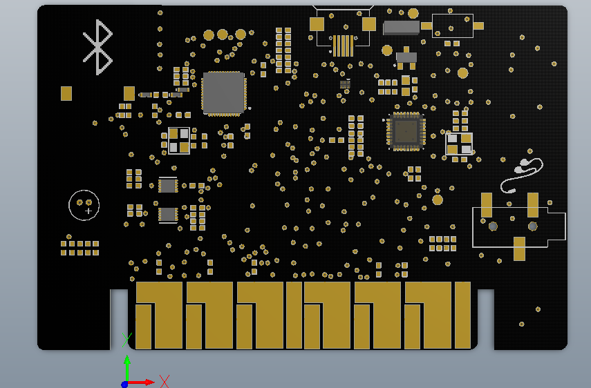

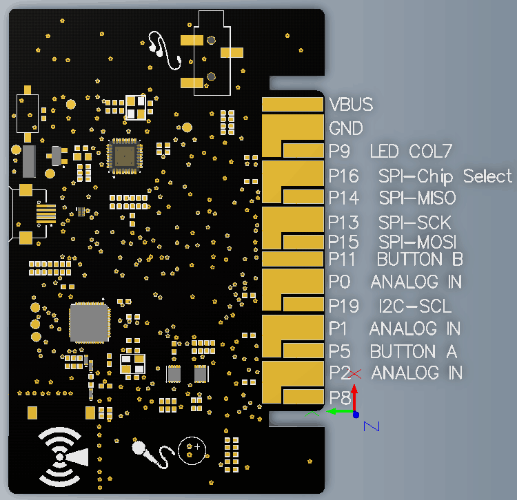

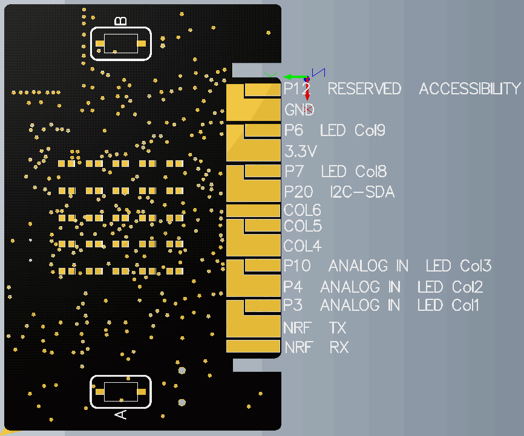

1、制作流程
---------------------
1.在打开网址http://turnipbit.tpyboard.com/之后，点击界面右上角的“编辑器”，进入图形编辑界面，如下图

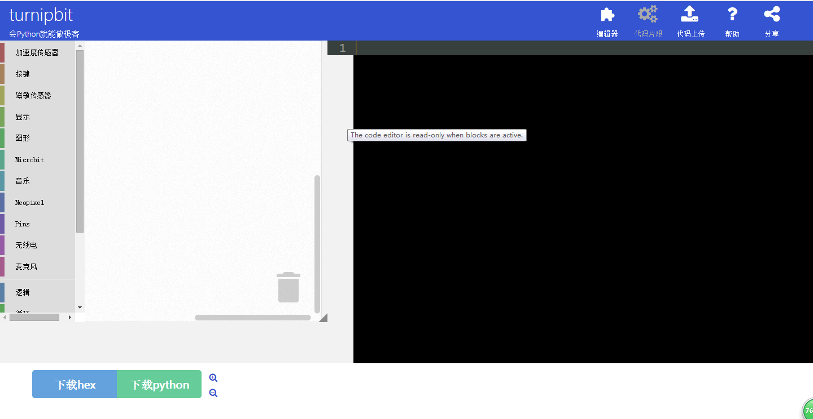

;
2.在界面左面的命令选择区域选择需要的命令；

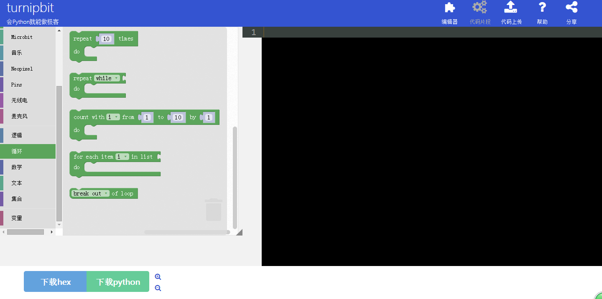

3.因为想要LED点阵显示字符串，所以要选择一个字符串显示的命令，可以看到，在左面的图形编程框中放入新的命令后，在右面的MicroPython代码显示框中，会出现相应的代码语句，如下图：
3.1点击左侧命令选择区域的“显示”；

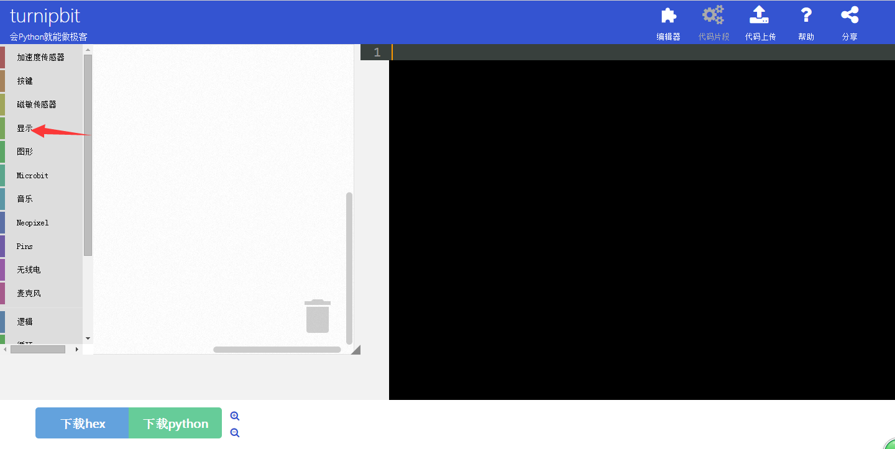

3.2在显示中选择箭头所指的字符串输出命令；

3.3选中字符串输出命令，并在在命令中修改相应的字符；

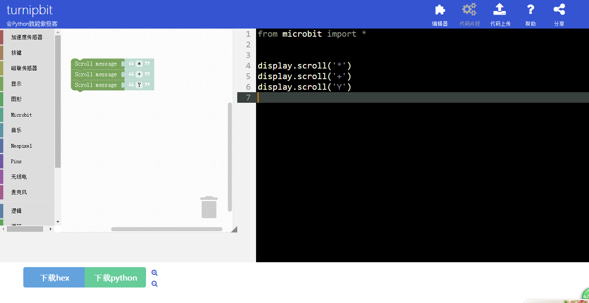

4.因为要让程序一直循环执行来扫面按键状态，所以要加入一个循环，如下图：
4.1点击命令选择区域的“循环”；

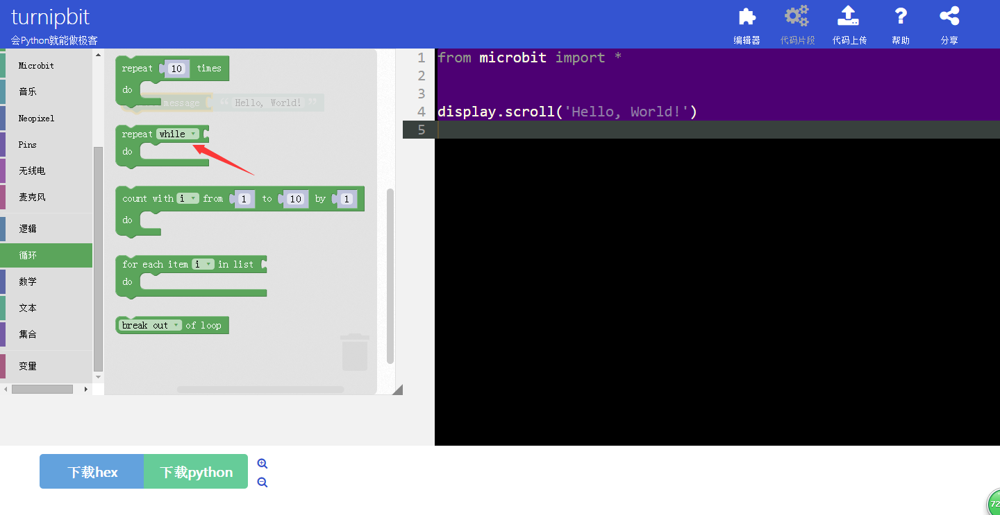

4.2把循环命令加入图形编辑框；

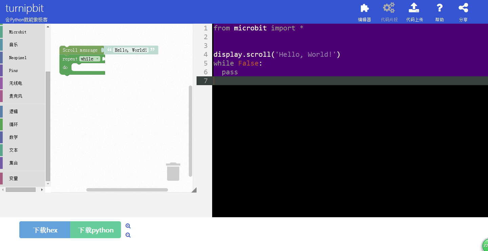

4.3循环需要一个循环条件，这里把循环条件设置成无线循环，点击命令选着区域的“逻辑”；

4.4选着“ture”；

.. image:: images/LED8.png

4.5把循环条件放入到循环命令的判断接口；

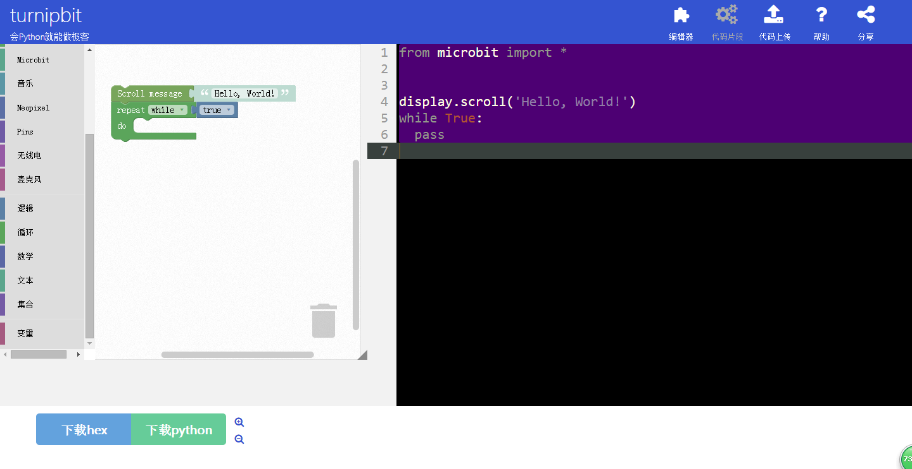

4.6把要循环执行的任务放到循环命令的执接口中；

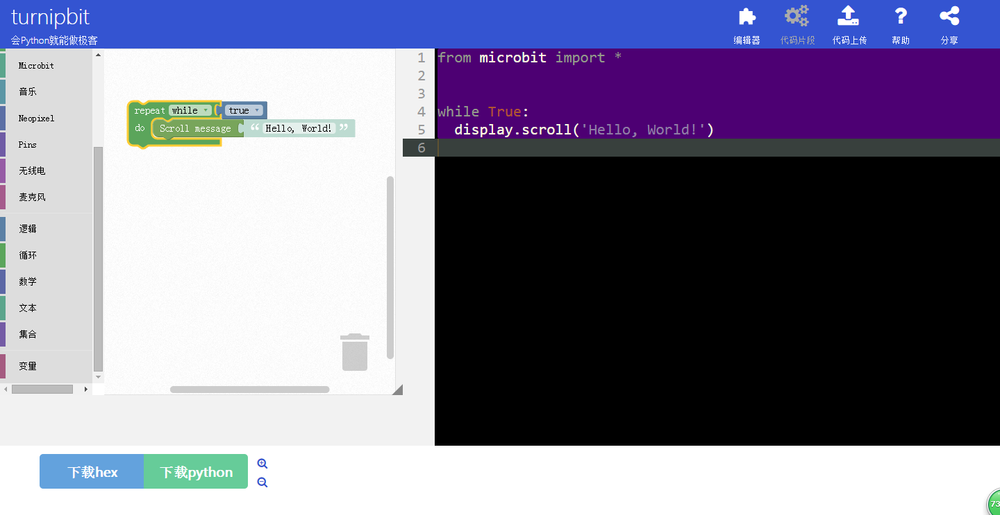

5.要做按键的控制，必须要加入按键如下图；
5.1点击命令选择区域的“按键”；

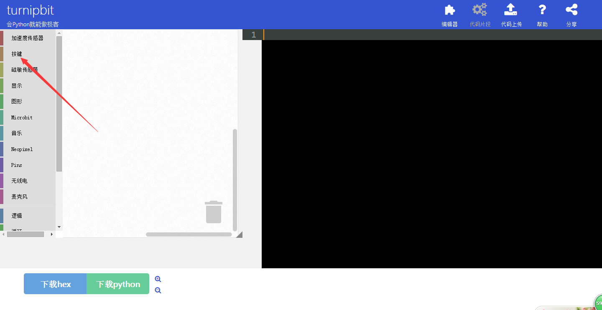

5.2选择“按键A被按下”；

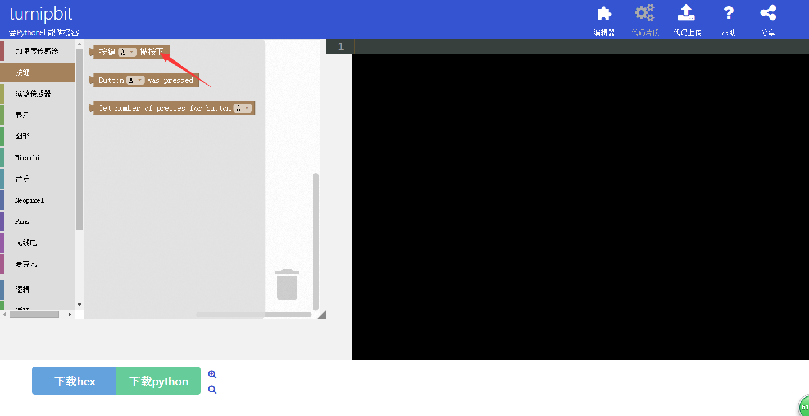

5.3加入两个按键状态扫描命令到图形编辑框中，并设置为那件A，B状态扫描；

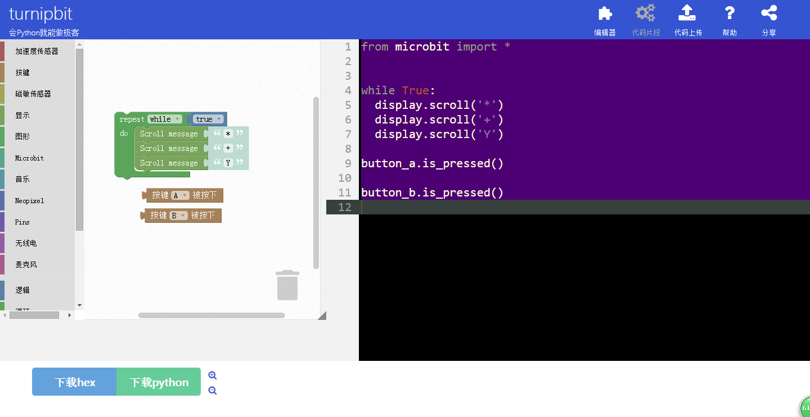

6.上面工作完成后，剩下的就是要做判断了，一直循环着判断A和B有没有按下，如图：
6.1点击命令选择区域“逻辑”；

.. image:: images/LE6.png

6.2点击选择“IF...DO”的命令；

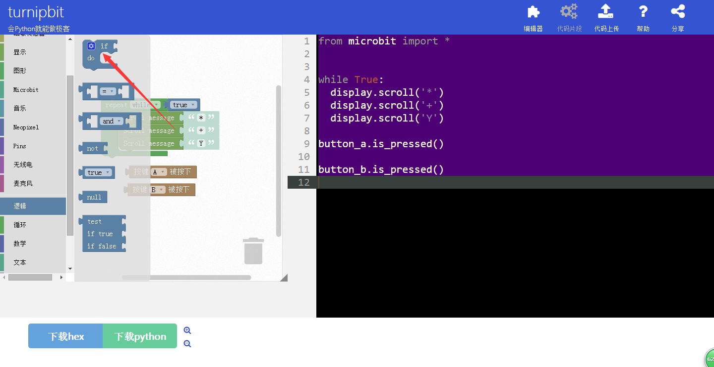

6.3把“IF...DO”的命令命令加入到图形编程框中，并组成相应逻辑；

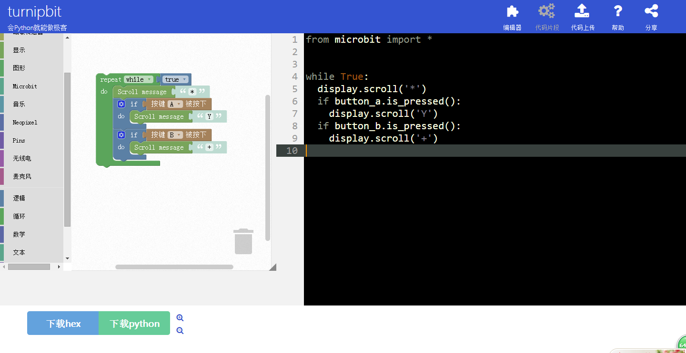

7. 编辑好你想要的图形逻辑代码后，点击左下角的下载hex，即可得到想要的固件；
8.在Turnipbit插上电脑后，出现一个盘符，打开盘符，把刚刚下载的固件复制进去，在复制固件进去的时候，板载的黄色指示灯会闪烁，同时在电脑界面会出现如下界面：

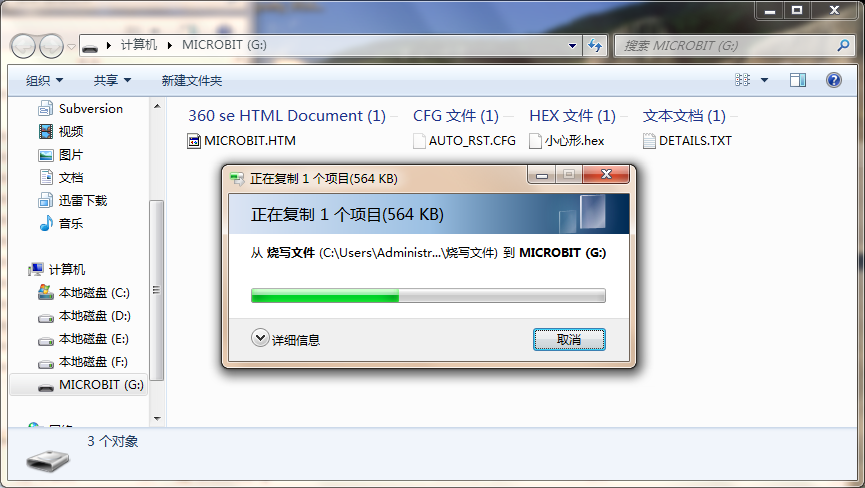

9.当固件复制完成后，Turnipbit会自动执行新的程序。