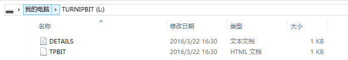
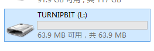
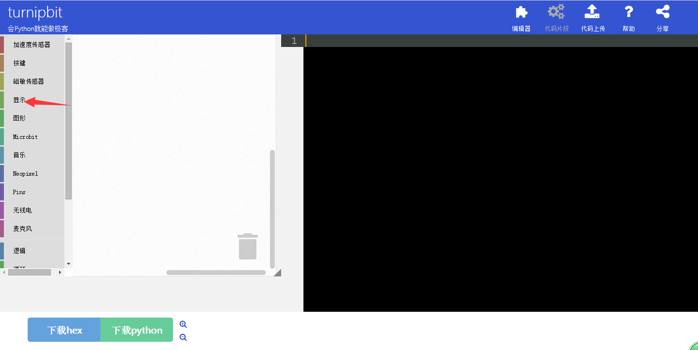
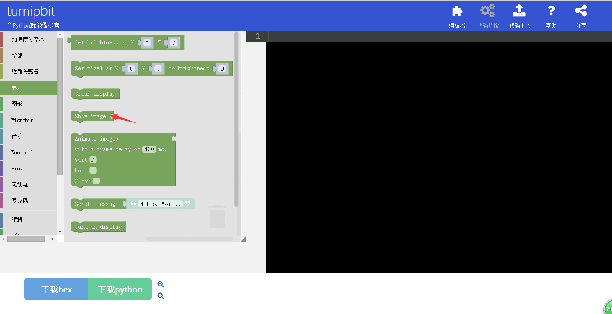
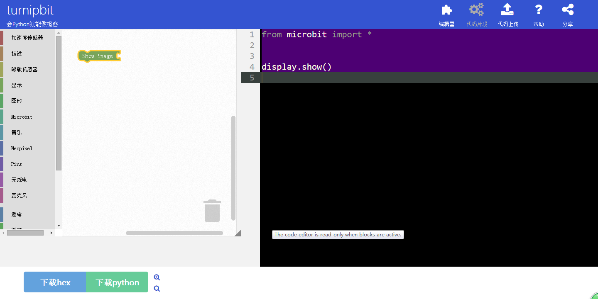
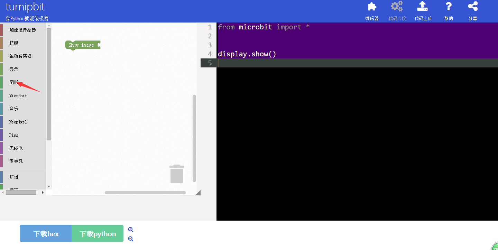
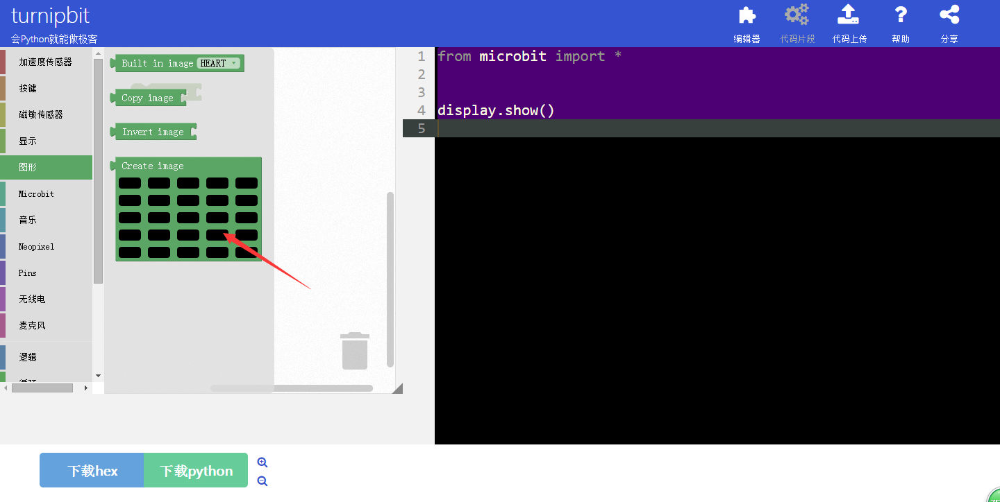
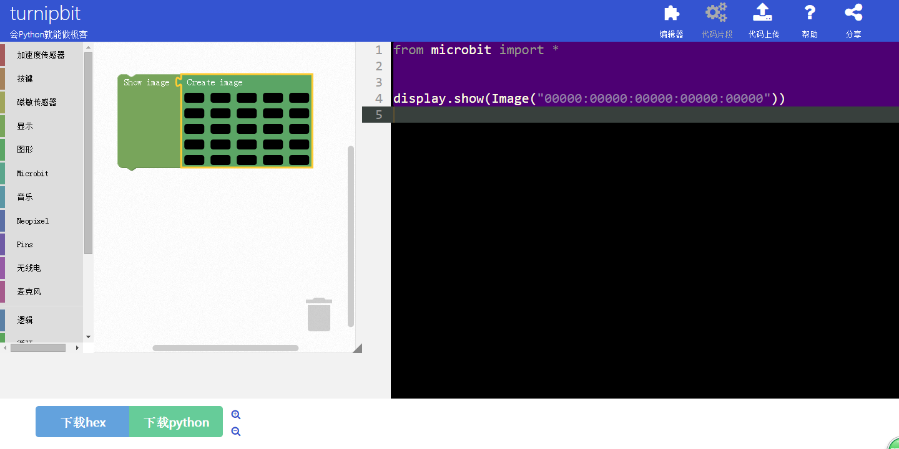
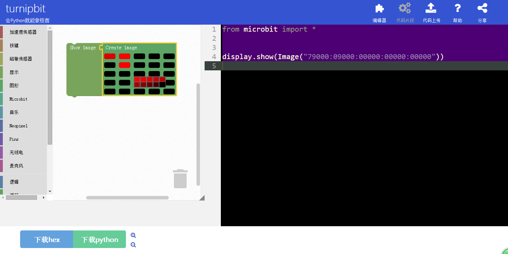

turnipbit的快速入门
===================================

	我们是一群极客爱好者，我们的目标是让您与我们一起通过代码，通过最简单的硬件拼接，与世界分享各种丰富有趣的创意。turnipbit就像是一个基本的主板，不管您是水平极高的硬件达人，还是什么都不会的初学爱好者，您都能在极短的时间，甚至是几分钟内编写出第一个“hello world”，制作出第一个闪烁的LED灯。
	您可以用turnipbit作什么？您可以像玩“乐高”积木一样学习，您还可以利用turnipbit实现任何酷炫的小发明，无论是机器人还是乐器，没有想不到。turnipbit拥有25个可显示消息的蓝色LED灯；有两个可编程按钮，可以用于控制游戏操作或者暂停/播放一首音乐。turnipbit可以检测动作并且告知你动作进行的方向，同时它也可以通过低功耗蓝牙模块与其它设备或因特网互联！
	我们为您提供了高品质的数据线及turnipbit主板。您还可以选配各种turnipbit适用的扩展连接件。我们提供了调试功能，所以你可以真正的询问系统，更多的了解你的turnipbit，灵活的搭配，创造属于你的设备。
	现在你可以登陆网页（http://turnipbit.tpyboard.com/），编写你自己的脚本创造属于你自己的创意了。任何人都可以通过简单的拖动，尝试自己写一段代码，然后将存储u盘文件一样简单的实现硬件烧写，您就会惊奇的发现，turnipbit正在按照您的创意开始工作了。
您还在等什么呢？让我们现在就开始吧！

一、turnipbit与电脑连接
------------------------------

将turnipbit插入电脑后，您的电脑上会显示一个TURNIPBIT的盘符，在这个盘符里会有microbit的介绍，如果您没有充足的时间完全可以忽略这些文件。此时，turnipbit的25个led灯会显示hello turnipbit字样。

二、开始我们的第一个程序
---------------------------------------

1.在打开网址http://turnipbit.tpyboard.com/之后，点击界面右上角的“编辑器”，进入图形编辑界面，如下图

.. image:: images/TDJJ1.png

;
2.在界面左面的命令选择区域选择需要的命令；

.. image:: images/TBJJ2.png

3.因为我想要LED点阵显示图形，所以要选择一个图形显示的命令，可以看到，在左面的图形编程框中放入新的命令后，在右面的MicroPython代码显示框中，会出现相应的代码语句，如下图：
3.1点击左侧命令选择区域的“显示”；

3.2在显示中选择箭头所指的图形输出；

3.3选中图形输出命令；

4.在加入图形显示命令后，再次选择命令选择区域中的图像框，加入图像编程框中，如下图：
4.1选择左侧命令选择区域的图形；

4.2选择图形中的图形绘制命令；

4.3选中图形绘制命令；

5.在图形绘制命令中可以选择设置相对应的LED灯的亮度，如下图：

6.绘制完成你想要的图案后，点击左下角的下载hex，即可得到想要的固件；
7.在Turnipbit插上电脑后，出现一个盘符，打开盘符，把刚刚下载的固件复制进去，在复制固件进去的时候，板载的黄色指示灯会闪烁，同时在电脑界面会出现如下界面：

.. image:: images/TBJJ11.png

8.当固件复制完成后，Turnipbit会自动执行新的程序。

三、观察效果

您会看到25个LED灯有序的闪动，显示hello！
好了，至此，您的第一个程序以及第一个极客创意就算完成了，余下的就是发挥您想像的时刻了。快来通过代码编写与世界分享你的创意，turnipbit将是你与世界万物互联的中心。我们正在努力令到你的代码编写经验更加流畅及有趣，我们非常乐于听到你的任何反馈。你可以直接邮件联系我们：*******.
