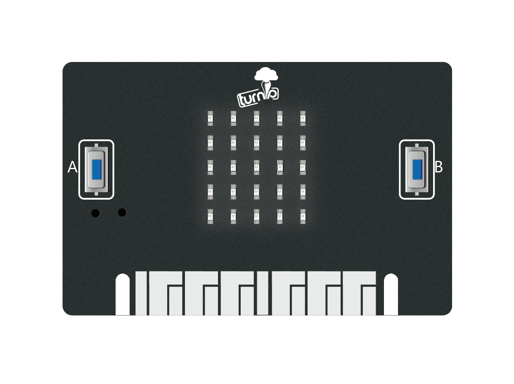

Hello, World!
-------------

用一种新的语言开始编程的传统方法是让你的计算机说, "Hello, World!".

使用MicroPython非常容易::

    from microbit import *
    display.scroll("Hello, World!")

第一行代码比较特殊::

    from microbit import *

...告诉MicroPython获取所有资源并在TurnipBit上执行。 这个模块就是 ``microbit`` (模块
是预先存在的代码库。)。 当使用 ``import`` 的东西就是告诉MicroPython要使用它, 并且 ``*`` 是Python的*everything*。
因此, ``from microbit import *`` 的意思是, "我想能够从TurnipBit代码库中使用一切"。

第二行::

    display.scroll("Hello, World!")

...告诉micropython使用显示滚动字符的字符串"Hello, World!"。 The ``display`` part of that line is an *object* from the
``microbit`` module that represents the device's physical display (we say
"object" instead of "thingy", "whatsit" or "doodah"). We can tell the display
to do things with a full-stop ``.`` followed by what looks like a command (in
fact it's something we call a *method*). In this case we're using the
``scroll`` method. Since ``scroll`` needs to know what characters to scroll
across the physical display we specify them between double quotes (``"``)
within parenthesis (``(`` and ``)``). These are called the *arguments*. So,
``display.scroll("Hello, World!")`` means, in English, "I want you to use the
display to scroll the text 'Hello, World!'". If a method doesn't need any
arguments we make this clear by using empty parenthesis like this: ``()``.

Copy the "Hello, World!" code into your editor and flash it onto the device.
Can you work out how to change the message? Can you make it say hello to you?
For example, I might make it say "Hello, Nicholas!". Here's a clue, you need to
change the scroll method's argument.

.. warning::

    It may not work. :-)

    This is where things get fun and MicroPython tries to be helpful. If
    it encounters an error it will scroll a helpful message on the micro:bit's
    display. If it can, it will tell you the line number for where the error
    can be found.

    Python expects you to type **EXACTLY** the right thing. So, for instance,
    ``Microbit``, ``microbit`` and ``microBit`` are all different things to
    Python. If MicroPython complains about a ``NameError`` it's probably
    because you've typed something inaccurately. It's like the difference
    between referring to "Nicholas" and "Nicolas". They're two different people
    but their names look very similar.

    If MicroPython complains about a ``SyntaxError`` you've simply typed code
    in a way that MicroPython can't understand. Check you're not missing any
    special characters like ``"`` or ``:``. It's like putting. a full stop in
    the middle of a sentence. It's hard to understand exactly what you mean.

    Your microbit may stop responding: you cannot flash new code to it or
    enter commands into the REPL. If this happens, try power cycling it. That
    is, unplug the USB cable (and battery cable if it's connected), then plug
    the cable back in again. You may also need to quit and re-start your code
    editor application.
